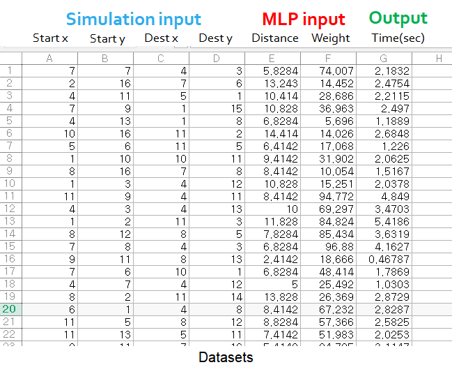
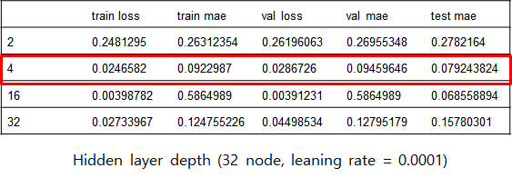

### Deep learning based Model for Predicting the Travel Time of a Mobile Robot

#### :heavy_check_mark:핵심  

기간 : 2020/10/19 - 2020/12/13  

프로젝트 요약 : 스마트 팩토리에 활용되고 있는 모바일 로봇에 Path Planning과 Deep learning 기술을 접목해서 생산 기술에 더 나은 서비스를 제공하는 것을 목적으로, Deep Learning 기반 모바일 로봇의 도착 소요 시간 예측 모델 제시  

역할 : 팀장  

* 프로젝트의 주제 제시 및 연구 방향 및 계획을 구체화  

* 총 3명의 팀원과 각자 3D 환경 구현 / 데이터 생산 / 딥러닝 학습으로 역할을 분담하였고 데이터 생산 부분을 담당  

* 인공지능 수업에서 이론에 대해서만 배운 A* 알고리즘을 다른 참조 코드 없이 직접 구현해보며 추상적으로 이해했던 개념을 확실하게 이해할 수 있었음  

  *이 코드를 2022년 다시 보았을 때, 우선순위 큐에 대한 이해 및 라이브러리도 없이 matlab을 이용하여 용케 구현해냈다는 생각을 했다. 현재 python을 이용해 다시 구현을 하게 된다면 조금 더 깔끔한 코드로 구현할 수 있을 것 같다.*  

* 지도 학습을 사용하는 MLP model의 input과 output에 사용할 수 있도록 dataset을 구조화하며 모델의 구성을 이해할 수 있었음  

* 딥러닝 학습을 맡은 팀원이 보내준 결과를 분석하며 training dataset, validation dataset, test dataset 각각의 용도에 대해서 설명하고 결과를 어떻게 내야 하는지에 대해서 조언  

 

#### :heavy_check_mark: 프로젝트 정리

##### Background

* 스마트 팩토리는 CPS(Cyber-Physical System) 기술을 가지고 있는데, 이는 네트워크의 정보를 이용하여 공장의 시스템을 제어하는 기술이다. 스마트 팩토리에서는 공장의 생산성 증가, 불량률 감소, 생산 시간을 단축하는 것에 초점을 두고 있다.  
* 스마트 팩토리 내에서 활용되고 있는 기술 중 무인 자율주행 로봇은 생산 현장에서 필요한 기능에 따라 물품의 이송이나 물품을 들어올리는 Manipulator 역할로 많이 활용되고 있다. 무인 자율주행 로봇은 여러 가지 기술을 가지고 있는데 대표적으로 인지, 판단, 제어의 기술이 있다.  
* 인지 부분에 여러가지 기술이 있지만 대표적으로 모든 실내의 위치정보를 로그해서 2D로 매핑하는 SLAM 기술이 있고, 판단 분야에서는 이 SLAM 기술을 기반으로 경로를 계획하여 시작점과 목표 지점까지의 최단 거리를 설정 하고, 장애물까지 회피할 수 있는 기술이 있다.  
* 이러한 기술들을 기반으로 모바일 로봇은 5G 스마트 팩토리에서 운송수단을 주로 맡고 있으며, 향후 딥러닝을 적용하여 경로 계획이나 다양한 분야에서 활용도를 높일 예정이다.   

 

##### Purpose of Research

  

* 우리는 이러한 스마트 팩토리의  모바일 로봇에 딥러닝 기술을 접목해서 생산 기술에 더 나은 서비스를 제공하는 방향으로 프로젝트의 초점을 맞추었다.  
* 현재 운송수단으로 활용되고 있는 무인 자율주행 로봇이 등속도로 움직이면서 물품의 하중에 비례하여 목적지까지 도착할 때 걸리는 시간을 산출할 수 있다면, 스마트 팩토리에서의 생산속도를 가속화 할 수 있으며 팩토리 내의 모든 무인 자율주행 로봇을 최대한 활용하여 저비용 고효율의 스마트 팩토리를 가져올 수 있을 것이라고 생각했다.  
* 연구 방향으로 Path Planning 알고리즘 중 하나인 A* 알고리즘을 활용하여 시작점과 목표 지점까지의 최단 거리를 확보하고자 했다.   

  * 해당 알고리즘을 사용한 이유는 휴리스틱 추정값을 사용하여 경로를 예측하기 때문에 시간 복잡도가 다른 알고리즘에 비해 더 낮아 연산 속도가 더 빠르기 때문이다.  
* Path Planning 연산 과정을 거쳐 최단 경로가 생성되고 난 뒤, 그에 대한 경로와 로봇에 인가되는 물체의 무게를 입력으로 하여 MLP(Multi-Layer Perceptron) 모델을 학습을 시켜 목적지에 도착하는데 걸리는 총 시간을 구하는 방향으로 진행했다.  

 

##### Description of Technology

  

*  A* 알고리즘을 사용하기 위해 모바일 로봇이 자율이동을 하는 실내 스마트 팩토리를 구현하였으며, 지나가지 못하는 장애물과 벽을 세워 ROS 기반의 3D 환경을 구현하였고 이를 2D로 만들어서 보기 쉽게 구현했다.   
* 환경은 50 by 50 meter로 이루어져 있고, 각 점들은 격자의 중심을 의미하며 간격을 1m로 지정했다. 최단 거리를 산출하기 위해 시작점과 도착점을 로봇이 위치할 수 있는 곳에 임의로 설정했다.  

  

* 모바일 로봇이 움직이는 방향은 그림과 같이 수직, 수평으로 이동하는 경우 1m, 대각선으로 이동하는 경우 루트 2m를 이동하는 것으로 지정하여 총 8개로 구성했다.   

  

* 그리고 출발 지점부터 목적지까지 휴리스틱 추정 값을 사용 하여 경로를 파악하는 특징을 가지는 A* 알고리즘의 평가 함수는 위와 같은데, *g*는 출발지부터 노드 *n*까지의 경로 가중치, *h*는 노드 *n*번부터 목적지까지의 추정 경로 가중치를 의미한다. 특히, 추정 경로 가중치를 구하는 과정은 절대값의 합으로 사용하고, 이 연산과정을 반복하여 최단 거리 *d*를 구한다.  

  

* 모바일 로봇은 기본적으로 등속 운동을 하고, 로봇이 조달하고자 하는 물체의 무게 *m*에 따라 로봇의 속력 *v*가 그림과 같이 선형적인 관계를 가진다고 가정한다.  

*   
* MLP 모델을 이용하여 예측을 진행한다. 활성화 함수로는 ReLU를 사용하였고 모델의 정확도를 측정하기 위해 MAE(Mean Absolute Error)를 사용하였다.  

 

##### Implementation

  

* MLP 모델을 학습하기 위한 데이터셋의 구성 방법이다. 총 50,000개의 데이터셋을 생성하였으며 training set으로 30,000개, validation set으로 10,000개 test set으로 10,000개를 사용하였다. 그리고 MLP 모델을 평가하기 위해 hyper parameter를 조정하며 MAE 결과를 비교하였다. 비교로 사용한 hyper parameter로는 optimization, hidden layer의 수, hidden layer 노드의 수, learning rate이다.  
     
* 첫번째로 optimization에 따른 결과를 비교했다. 비교 방법으로는 SGD(Stochastic Gradient Descent)와 Adam을 사용하였다.  
* SGD를 사용했을 때, train loss은 6.05 point, train accuracy는 1.78 point 라는 결과가 나왔다. SGD를 썼을 때 변동이 심하게 발생하였으며, 이를 안정화 하기 위해서 Learning rate 를 10의 -7승까지 줄여야 했다.  
* Adam 모델을 사용하였을 때 train loss는 0.44 point, train accuracy는 0.33 point를 나타냈으며, 더 빠르고 안정적으로 loss와 accuracy가 0에 가깝게 수렴하였다. 따라서 이후 실험의 경우, Adam optimizer로 고정하여 진행했다.  

  

* 두 번째로 learning rate에 따른 결과를 비교했다. learning rate가 0.00001인 경우에는 loss를 보았을 때 수렴 속도가 너무 오래 걸리는 것을 확인하였다. learning rate가 0.0001인 경우에도 높은 정확도를 보였고 빠른 수렴을 보였기 때문에 이후 실험의 경우, 해당 값으로 고정하여 진행했다.  

  

* 세 번째로 Hidden layer의 수에 따른 실험을 진행하였다. layer가 4개일 때 안정적인 결과를 내는 것을 확인할 수 있다.  

  

* 네 번째로 Hidden layer의 노드 수에 따른 실험을 진행하였다. 노드가 256개일 때 가장 안정적인 결과를 내는 것을 확인할 수 있다.

 

##### Result

  
